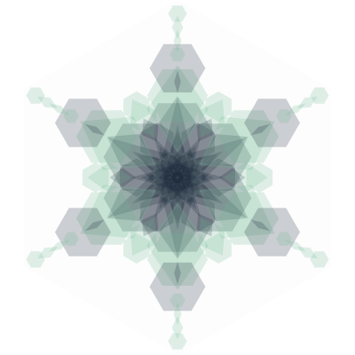

# snowflake.js

A JavaScript program to generate random snowflakes in SVG format.



Usage:
```html
<html>
  <body>
    <snowflake-svg width="100" height="100" seed="9036"></snowflake-svg>
  </body>
  <script src="script/snowflake.js"></script>
</html>
```
